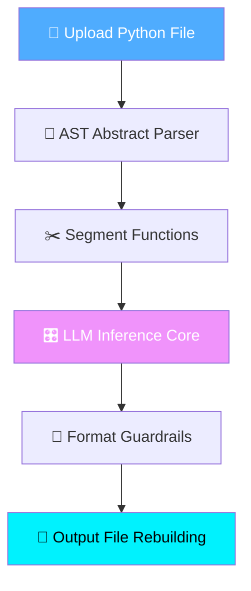

<div align="center">

# 📜 AutoDoc Generator — Python AST & LLM Documentation Pipeline

[](https://git.io/typing-svg)


<br/>

[](https://autodoc-generator-project.streamlit.app/)
[](https://github.com/mayank-goyal09/Autodoc-generator/stargazers)
[](https://github.com/mayank-goyal09/Autodoc-generator/network)

<br/>

### 🧠 **Harnessing Python Abstract Syntax Trees (AST) & Cloud Large Language Models** 

### **From Raw Source Code → Professional Guarantee-Driven Docstrings** 🐍

</div>

---

## ⚡ **THE PIPELINE AT A GLANCE**

<table>
<tr>
<td width="50%">

### 🎯 **What This Project Does**
This end-to-end **documentation engine** parses Python scripts into Abstract Syntax Trees, extracts standalone functions/classes, and uses powerful language models to automatically inject precise docstrings.

**The Evolution Journey:**
- ❌ **Earlier Approach:** Local models (<1.5B parameters) that lacked logical context, causing token processing crashes and logical hallucinations.
- ✅ **Current Approach:** Serverless inference infrastructure executing clean architecture logic.

</td>
<td width="50%">

### ✨ **Key Highlights**

| Feature | Details |
|---------|---------|
| 🧬 **Parsing Engine** | Native Python AST |
| 🤖 **LLM Engine** | Llama-3.3-70B-Instruct |
| 🔒 **Secret Injection** | Streamlit Cloud TOML |
| ⏱️ **Speed** | Cloud-based processing |
| 📚 **Targeting Style** | 100% Clean Docstrings |
| 🎨 **Interface** | Fast web deployment |

</td>
</tr>
</table>

---

## 🔬 **EVOLUTION: WHAT WE SOLVED**

### 🔴 What We Tried Earlier (Failure Modes)
1. **Underpowered Local Models:** Tested models like *Salesforce CodeGen*, *CodeT5*, and *Phi-1.5*. Due to limited capacity (<1.5B parameters), they hallucinated illogical summaries (e.g., claiming `divide` executes multiplication).
2. **Environment Dependencies:** Python 3.13 strict local dependency rules broke explicit tokenizing pipelines without specialized C++ compilers.

### 🟢 What We Engineered Now (The Solution)
1. **Hugging Face Serverless Access:** Bypassed strict local hardware bottlenecks using `huggingface_hub` to query enterprise-tier **Llama-3.3-70B**.
2. **Constraint Rules:** Engineered state-of-the-art zero-shot formatting requirements:
   - **Document What, Not How:** Focuses on endpoint goals instead of structural loops.
   - **Define Bounds:** Mentions restrictions explicitly (e.g. `b != 0`).
   - **Lean Phrasing:** Eliminates generic filler language.

---

## 🛠️ **TECHNOLOGY STACK**

<div align="center">


</div>

| **Category** | **Technologies** | **Purpose** |
|:------------:|:-----------------|:------------|
| 🐍 **Core Language** | Python 3.10+ | Primary architecture environment |
| 🧠 **Cloud AI** | Hugging Face Hub | API requests for Llama parameters |
| 📊 **AST Node Logic** | Python standard library | Code decomposition |
| 🎨 **Frontend** | Streamlit | Dynamic operational views |

---

## 🔬 **HOW THE AUTODOC LOGIC FLOWS**



---

## 📂 **PROJECT STRUCTURE**

```
💻 project-59-AutoDoc-Generator/
│
├── 📊 app.py                              # Streamlit web visualizer
├── ⚙️ main.py                              # Terminal operational core
├── 🧠 model_inference.py                  # Hugging Face payload pipeline
├── 🧩 parser_engine.py                     # Syntax tree logic
│
├── 📦 requirements.txt                    # Required setups
└── 📖 README.md                           # System documentation 🎉
```

---

## 🚀 **QUICK START SETUP**

### **Step 1: Pull down repository** 📥

```bash
git clone https://github.com/mayank-goyal09/Autodoc-generator.git
cd Autodoc-generator
```

### **Step 2: Establish boundaries** 🐍

```bash
python -m venv venv
source venv/bin/activate  # On Windows: venv\Scripts\activate
```

### **Step 3: Pull down modules** 📦

```bash
pip install -r requirements.txt
```

### **Step 4: Run processing checks** 🎯

```bash
python main.py --file sample_code.py
```

---

## 👨‍💻 **CONNECT WITH ME**

<div align="center">

[](https://github.com/mayank-goyal09)
[](https://www.linkedin.com/in/mayank-goyal-4b8756363/)
[](https://mayank-portfolio-delta.vercel.app/)

<br/>

### 🌦️ **Built with clean design protocols by Mayank Goyal**

</div>
